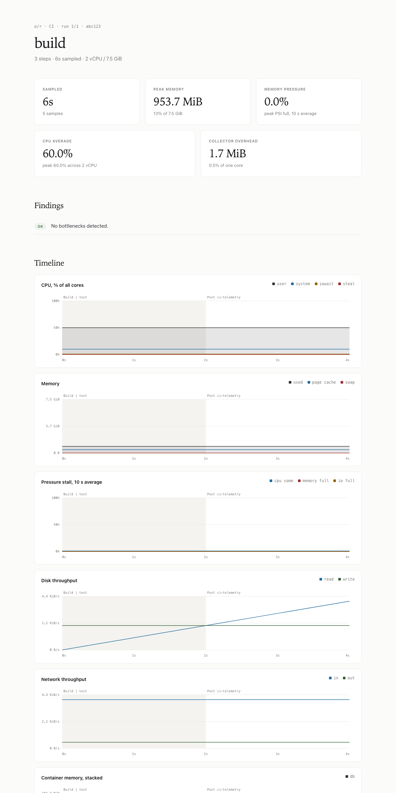
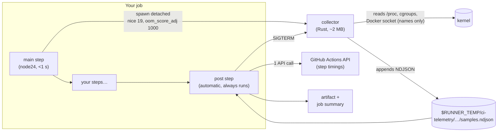

<h1 align="center">ci-telemetry</h1>

<p align="center">
  <strong>Find out which CI step is slow and why, with one line of YAML.</strong><br/>
  Per-step CPU, memory, pressure, disk, network and Docker telemetry for GitHub Actions jobs,<br/>
  collected by a ~2 MB Rust sidecar and uploaded as an artifact when the job ends.
</p>

<p align="center">
  <a href="https://github.com/NISHANTH1221/action-telemetry/actions/workflows/ci.yml"></a>
  <a href="https://github.com/NISHANTH1221/action-telemetry/actions/workflows/e2e.yml"></a>
  <a href="https://github.com/NISHANTH1221/action-telemetry/releases"></a>
  <a href="./LICENSE"></a>
  
  
</p>

<p align="center">
  <a href="#-quickstart">Quickstart</a> ·
  <a href="#-self-hosted-runners">Self-hosted runners</a> ·
  <a href="#-faq">FAQ</a> ·
  <a href="./CONTRIBUTING.md">Contributing</a> ·
  <a href="https://github.com/NISHANTH1221/action-telemetry/issues">Issues</a>
</p>

<p align="center">
  
</p>

<hr/>

<details>
<summary><strong>📁 Table of contents</strong></summary>

- [What is ci-telemetry?](#-what-is-ci-telemetry)
- [Scope](#-scope)
- [Quickstart](#-quickstart)
- [Using it in your workflows](#-using-it-in-your-workflows)
- [What you get](#-what-you-get)
- [Inputs](#%EF%B8%8F-inputs)
- [How it works](#-how-it-works)
- [What's collected](#-whats-collected)
- [Self-hosted runners](#-self-hosted-runners)
- [Overhead and safety guarantees](#%EF%B8%8F-overhead-and-safety-guarantees)
- [Permissions and graceful degradation](#-permissions-and-graceful-degradation)
- [Limitations](#%EF%B8%8F-limitations)
- [FAQ](#-faq)
- [Security and verifying releases](#-security-and-verifying-releases)
- [Contributing](#-contributing)
- [Versioning](#-versioning)
- [License](#-license)

</details>

## 🔎 What is ci-telemetry?

CI jobs get slow for many reasons: a CPU-bound compile, a test suite that exhausts memory, a Docker build waiting on disk, a noisy neighbour on the host. The Actions UI only tells you *how long* each step took. **ci-telemetry tells you why.**

Add one step at the top of a job. A tiny background collector samples the machine every second for the rest of the job. When the job finishes, even if it failed or a step was OOM-killed, the action's automatic `post` step:

- lines the samples up against each step's start and end times,
- detects OOM kills (kernel, per container, and of the collector itself),
- flags bottlenecks, such as *"Step `Test` was memory-starved; the runner is probably undersized"*,
- writes a table for each step into the **job summary**, and
- uploads an **artifact** with the raw samples, `report.json` and a self-contained `report.html`.

It is built to be invisible to the job it measures. The collector's footprint is budgeted at **≤ 5 MB RSS and ≤ 0.5 % of one core**. It runs at the lowest CPU priority and is the kernel's first choice to kill under memory pressure. It makes no network calls while your steps run, and **the action never fails your job**.

## 🎯 Scope

| ✅ In scope | ❌ Out of scope (today) |
|---|---|
| Performance tuning of a single **job**: per-step CPU, memory, PSI pressure, disk and network | Security/audit telemetry (network connections, file access, process arguments) |
| **Docker** containers started during the job: service containers, `docker build`, `docker run` | Metrics for the *Set up job* / *Initialize containers* phases (only their durations are reported) |
| **OOM detection**: kernel, per-container, and a killed collector | Streaming data off the machine while the job runs |
| Linux **x64 and arm64**, on GitHub-hosted and self-hosted runners | macOS and Windows runners (the action logs a notice and does nothing) |
| github.com | GitHub Enterprise Server |
| Evidence you can act on: findings, summary tables, raw NDJSON for your own analysis | Aggregating many runs into dashboards (the `report.json` schema is stable, so you can build this yourself) |

## 🚀 Quickstart

Add the action as the **first step** of any Linux job:

```yaml
jobs:
  build:
    runs-on: ubuntu-latest
    permissions:
      contents: read
      actions: read            # lets the post step read per-step timings
    steps:
      - uses: NISHANTH1221/action-telemetry@v1   # ← first step
      - uses: actions/checkout@v4
      - run: make build
      - run: make test
```

That's all. Open the run and you'll see:

1. A **CI telemetry** section in the job summary, with a table for each step and any findings.
2. An artifact named `ci-telemetry-<job>-<attempt>-<hash>`. Download it and open `report.html`.

> [!TIP]
> It has to be the **first** step. Only work done after it starts is sampled, and it needs to be early so its `post` step runs *after* everything else.

## 🧩 Using it in your workflows

<details>
<summary><strong>Every job in a workflow</strong></summary>

Telemetry is per job, so add the step to each job you want to measure:

```yaml
jobs:
  lint:
    runs-on: ubuntu-latest
    permissions: { contents: read, actions: read }
    steps:
      - uses: NISHANTH1221/action-telemetry@v1
      - uses: actions/checkout@v4
      - run: npm ci && npm run lint

  test:
    runs-on: ubuntu-latest
    permissions: { contents: read, actions: read }
    steps:
      - uses: NISHANTH1221/action-telemetry@v1
      - uses: actions/checkout@v4
      - run: npm ci && npm test
```

</details>

<details>
<summary><strong>Matrix builds</strong></summary>

Every leg of a matrix gets its own artifact with no extra configuration. The default name includes a hash of the runner name and the job start time, so legs never collide:

```yaml
jobs:
  test:
    strategy:
      matrix:
        node: [20, 22, 24]
    runs-on: ubuntu-latest
    permissions: { contents: read, actions: read }
    steps:
      - uses: NISHANTH1221/action-telemetry@v1
      - uses: actions/checkout@v4
      - uses: actions/setup-node@v4
        with: { node-version: ${{ matrix.node }} }
      - run: npm ci && npm test
```

If you'd rather have readable names, set `artifact-name`, and make sure it's unique per leg:

```yaml
      - uses: NISHANTH1221/action-telemetry@v1
        with:
          artifact-name: telemetry-node-${{ matrix.node }}
```

</details>

<details>
<summary><strong>Service containers, <code>docker build</code> and <code>docker compose</code></strong></summary>

Nothing extra is needed. Containers are discovered from their cgroups every 2 s, and names and images are looked up once through the Docker socket:

```yaml
jobs:
  integration:
    runs-on: ubuntu-latest
    permissions: { contents: read, actions: read }
    services:
      postgres:
        image: postgres:16
        env: { POSTGRES_PASSWORD: postgres }
    steps:
      - uses: NISHANTH1221/action-telemetry@v1
      - uses: actions/checkout@v4
      - run: docker compose up -d && make integration-test
```

The report then includes a table for each container (CPU, peak memory, OOM kills) and a stacked chart of container memory.

</details>

<details>
<summary><strong>Tuning sampling and output</strong></summary>

```yaml
      - uses: NISHANTH1221/action-telemetry@v1
        with:
          interval: 2              # sample every 2 s (default 1)
          process-interval: 0      # turn off top-process snapshots
          docker: false            # skip container stats
          html-report: false       # artifact holds only samples.ndjson + report.json
          job-summary: true
          retention-days: 3
```

</details>

<details>
<summary><strong>Tight token permissions</strong></summary>

The token is used **once**, in the post step, to call `GET /repos/{owner}/{repo}/actions/runs/{run_id}/attempts/{attempt}/jobs`. It needs `actions: read`. Without it you still get every resource metric and the whole-job charts, just no breakdown by step. The job does not fail.

```yaml
permissions:
  contents: read
  actions: read
```

</details>

<details>
<summary><strong>Using the report in later jobs</strong></summary>

Because the report is an artifact, a later job can download it and act on it, for example to comment on a PR or enforce a budget:

```yaml
  budget:
    needs: build
    runs-on: ubuntu-latest
    steps:
      - uses: actions/download-artifact@v4
        with: { pattern: ci-telemetry-build-*, path: telemetry, merge-multiple: false }
      - run: |
          jq -e '[.findings[] | select(.level=="error")] | length == 0' telemetry/*/report.json
```

`report.json` follows [`schema/report.schema.json`](schema/report.schema.json) (`schema_version: 1`).

</details>

## 📦 What you get

| Output | Where | Contents |
|---|---|---|
| **Job summary** | The run page, under the job | Runner size, sampled duration, collector overhead, findings, and tables for each step and each container |
| `report.html` | Artifact | Self-contained page with no external resources or scripts. It has summary cards, findings, time-series charts for CPU, memory, PSI, disk, network and container memory with step bands and OOM markers, and step, container and OOM tables. Light and dark themes. |
| `report.json` | Artifact | Machine-readable report: job and runner info, capabilities, stats for each step and container, OOM events, findings, collector overhead |
| `samples.ndjson` | Artifact | Raw collector output, one JSON record per line, for your own analysis |

**Findings** are simple threshold rules:

| Finding | Rule |
|---|---|
| 🔴 OOM kill | Any OOM event (kernel, container or collector) |
| ⚠️ Memory-starved | Step ≥ 30 s with peak memory pressure `mem_full` ≥ 10 % |
| ⚠️ CPU-bound | Step ≥ 30 s with average CPU (usr + sys) ≥ 90 % |
| ⚠️ I/O-bound | Step ≥ 30 s with peak `io_full` ≥ 20 % |
| ⚠️ Noisy neighbour | Average CPU steal ≥ 5 % over the job |
| ⚠️ Disk nearly full | Free space on `/` or the workspace below 1 GiB |
| ⚠️ Swapping | Swap use grew during the job |

## ⚙️ Inputs

All inputs are optional.

| Input | Default | Range / notes |
|---|---|---|
| `interval` | `1` | Seconds between samples, 1–60. |
| `process-interval` | `5` | Seconds between top-process snapshots, 0–300 (`0` disables). |
| `docker` | `true` | Collect CPU, memory, I/O and OOM stats for each container from Docker cgroups. |
| `github-token` | `${{ github.token }}` | Used once, in the post step, to read step timings. Needs `actions: read`. |
| `artifact-name` | `''` | Empty means auto-generated: `ci-telemetry-<job>-<attempt>-<hash>`. |
| `retention-days` | `7` | Artifact retention in days, 1–90. |
| `job-summary` | `true` | Write the step table and findings to the job summary. |
| `html-report` | `true` | Include a self-contained `report.html` in the artifact. |

An invalid value falls back to its default with a warning; it never fails the job. The action has **no outputs**, because outputs set in a `post` step can't be read by any later step. Use the artifact instead.

## 🏗 How it works



1. **`main`** (under a second) finds the runner's `Runner.Worker` process, starts the collector detached at the lowest priority, and saves its PID in the action state.
2. **The collector** reads `/proc` and cgroup files once per tick and writes one NDJSON line per tick. It spawns no child processes, drops its written pages from the page cache, halves its sampling rate each time the data file passes 50 MiB, and exits by itself if the job's worker process disappears or 72 h pass.
3. **`post`** runs even when earlier steps fail or are OOM-killed. It stops the collector, fetches step timings with one paginated API call, reads `dmesg` for OOM kills (if passwordless `sudo` is available), builds the report, and uploads it.

The NDJSON file is the only interface between the Rust and TypeScript halves, so either side can change on its own.

## 📊 What's collected

| Group | Fields | Source | Cadence |
|---|---|---|---|
| CPU | `usr`, `sys`, `iow`, `steal` (% of all CPUs on the host) | `/proc/stat` | every tick |
| Load | `load1` | `/proc/loadavg` | every tick |
| Memory | `used`, `avail`, `cached`, `swap` (bytes) | `/proc/meminfo` | every tick |
| Pressure | `cpu_some`, `mem_some`, `mem_full`, `io_some`, `io_full` (avg10 %) | `/proc/pressure/*` | every tick |
| Disk I/O | `rd`, `wr` (bytes/s; whole disks only, no partitions or loop devices) | `/proc/diskstats` | every tick |
| Network | `rx`, `tx` (bytes/s; excludes `lo` and bridge/veth interfaces) | `/proc/net/dev` | every tick |
| Filesystem | free bytes on `/` and on `$GITHUB_WORKSPACE` | `statvfs` | every 10 s |
| Processes | top 5 by CPU and top 5 by RSS: `pid`, `comm`, `cpu`, `rss` | `/proc/[pid]/stat` (CPU times; RSS from field 24) | `process-interval` (default 5 s) |
| Containers | `id`, `cpu`, `mem`, `mem_peak`, `io_rd`, `io_wr`, `oom_kills` | cgroup v2 `docker-<id>.scope/{cpu.stat,memory.current,memory.peak,memory.events,io.stat}` | every 2 s |

**CPU units:** host CPU is a percentage of *all* CPUs combined. Process and container CPU is a percentage of *one* core, like `top`, so a two-thread process can read 200 %.

**Privacy:** the artifact contains process command names (`comm`, at most 15 characters) and container names and images. It never contains command-line arguments, environment variables or file contents. The artifact is visible to anyone who can read the repository's Actions runs.

## 🖥 Self-hosted runners

The action works on self-hosted Linux runners (x64 and arm64). Everything beyond the basics degrades gracefully, so a missing capability removes one feature and never fails the job. Use this checklist to get the full report.

### Requirements

| Requirement | Needed for | Check with | If missing |
|---|---|---|---|
| Linux **x64 or arm64** | Anything at all | `uname -sm` | Notice logged, action does nothing |
| `actions/runner` recent enough for **`node24`** actions | Running the action | Runner release notes | Runner refuses the action |
| Access to **github.com** APIs (the runner already needs this) | Step timings, artifact upload | n/a | Report without step breakdown / upload warning |
| Kernel **≥ 4.20** with PSI enabled | Pressure metrics and the memory-starved / I/O-bound findings | `cat /proc/pressure/cpu` | `capabilities.psi: false`, no PSI charts |
| **cgroup v2** (unified hierarchy) | Stats for each container | `stat -fc %T /sys/fs/cgroup` → `cgroup2fs` | `capabilities.docker_cgroups: false` |
| Runner user can read **`/var/run/docker.sock`** | Container names and images | `docker ps` as the runner user | Containers shown by 12-character ID |
| **Passwordless `sudo` for `dmesg`** | Kernel OOM detection | `sudo -n dmesg --time-format iso \| tail -1` | `capabilities.dmesg: false`; container and collector OOMs are still detected |

### Minimal setup

```bash
# 1. Docker access for the runner user (names and images of containers)
sudo usermod -aG docker "$RUNNER_USER"

# 2. Allow only dmesg without a password (kernel OOM detection)
echo "$RUNNER_USER ALL=(root) NOPASSWD: /usr/bin/dmesg" | sudo tee /etc/sudoers.d/ci-telemetry-dmesg
sudo chmod 0440 /etc/sudoers.d/ci-telemetry-dmesg
sudo visudo -cf /etc/sudoers.d/ci-telemetry-dmesg

# 3. Confirm PSI and cgroup v2
cat /proc/pressure/memory && stat -fc %T /sys/fs/cgroup
```

On Ubuntu 22.04+ and Debian 12+, PSI and cgroup v2 are on by default. On older distributions, boot with `systemd.unified_cgroup_hierarchy=1` (and `psi=1` if your kernel was built with `CONFIG_PSI_DEFAULT_DISABLED`).

### Runner topologies

<details>
<summary><strong>Persistent (long-lived) runners</strong></summary>

- The collector watches the job's `Runner.Worker` process and exits as soon as it disappears. If the runner is killed before `post` runs, the collector doesn't outlive the job, and it stops after 72 h in any case.
- Each use of the action gets its own data directory under `$RUNNER_TEMP/ci-telemetry/`. Using it twice in one job is safe.
- Data lives in `$RUNNER_TEMP`, which the runner cleans between jobs.

</details>

<details>
<summary><strong>Ephemeral runners (<code>--ephemeral</code>, autoscaled VMs)</strong></summary>

This works out of the box. Bake the Docker group membership and the `sudoers` drop-in above into your VM image so every runner has them.

</details>

<details>
<summary><strong>Runners inside containers or Kubernetes (e.g. Actions Runner Controller)</strong></summary>

When the runner itself runs in a container, the action sees the world from inside that container:

- `/proc/stat` and `/proc/meminfo` usually show the **node's** totals rather than the pod's limits, so read memory percentages with that in mind.
- Containers started through a **Docker-in-Docker sidecar** live in another cgroup namespace and are **not visible**, so there are no per-container stats. Mounting the host's Docker socket makes names resolvable, but cgroup visibility still depends on your cgroup namespace setup.
- `dmesg` is normally not available.
- `Runner.Worker` may not be an ancestor of the action process. The watchdog then turns itself off, and the collector stops when `post` runs (or after 72 h).

Every one of these shows up in `report.json → capabilities`, so you can see exactly what was available on a given run.

</details>

<details>
<summary><strong>Jobs with <code>container:</code></strong></summary>

With `container:`, JavaScript actions and therefore the collector run **inside the job container**. You get host-level CPU and memory, but usually no stats for other containers, no Docker socket and no `dmesg`. The collector is a static musl binary, so it runs in Alpine and distroless-style images too.

</details>

<details>
<summary><strong>Air-gapped or proxied networks</strong></summary>

The collector makes no network connections. The only network use is in `post`: one call to the Actions API (using `GITHUB_API_URL`) and the artifact upload, both through the same endpoints and proxy settings the runner already uses. GitHub Enterprise Server is **not** supported, because the artifact upload client doesn't support GHES.

</details>

### Troubleshooting

| Symptom | Likely cause | Fix |
|---|---|---|
| `telemetry is not supported on <os>/<arch>` notice | Not Linux x64/arm64 | Run the job on a Linux runner |
| *Per-step breakdown unavailable: GitHub API returned 403* | Token lacks `actions: read` | Add `permissions: { actions: read }` to the job |
| *…no in-progress job found for runner '…'* | Runner name mismatch (rare with custom runner labels) | Report an issue with the run URL |
| No containers in the report | cgroup v1, or containers in a DinD sidecar | Check `capabilities`; move to cgroup v2 or the host Docker |
| Containers shown as 12-character IDs | Runner user can't read the Docker socket | Add the user to the `docker` group |
| No kernel OOM events | No passwordless `sudo` for `dmesg` | Add the sudoers drop-in above |
| *Telemetry was unavailable for this job* | Collector failed to start (see the warning in the first step) | Report an issue with that warning |
| Artifact upload warning | Artifact storage quota, or a name clash with `artifact-name` | Free quota, or use a unique `artifact-name` |

## 🛡️ Overhead and safety guarantees

- **Budget:** peak RSS ≤ 5 MB and average CPU ≤ 0.5 % of one core over a 5-minute workload. This is enforced by this repository's end-to-end tests, and every report records the actual figures for that run in its `collector` block (`peak_rss`, `cpu_seconds`, `avg_cpu_pct`, `end_reason`).
- **Priority:** the collector runs at `nice 19` and sets `oom_score_adj` to `1000`. Under memory pressure the kernel prefers to kill the collector before your job's processes. If that happens, the report says so and keeps everything collected up to that point.
- **Never fails your job:** every error in `main` and `post` becomes a warning, and each optional source (API, `dmesg`, Docker socket, PSI, cgroups, HTML, summary, upload) degrades on its own.
- **No network while your steps run**, and no child processes. Data is written one line per tick, so a crash can only lose the last partial line.

## 🔐 Permissions and graceful degradation

| Capability | Used for | Without it |
|---|---|---|
| `actions: read` on the token | Step timings | `steps: null` plus `steps_error`; whole-job charts only |
| Passwordless `sudo -n dmesg` | Kernel OOM kills | `capabilities.dmesg: false`; container OOMs still detected |
| Docker socket | Container names and images | Containers labelled by short ID |
| PSI (`/proc/pressure`) | Pressure metrics and two findings | `capabilities.psi: false` |
| cgroup v2 | Stats for each container | `capabilities.docker_cgroups: false` |

## ⚠️ Limitations

- **Linux only** (x64 and arm64). Other operating systems and architectures get a notice and no telemetry.
- **GitHub Enterprise Server is not supported** (the `@actions/artifact` v2 client doesn't support GHES).
- Metrics start when the action's step runs. Work done in steps before it, including *Set up job* and *Initialize containers*, is not sampled; only its duration is reported.
- Step boundaries have 1-second resolution, the limit of the API.
- **Container OOM timing:** Docker removes a container's cgroup as soon as it exits. If a container's *main process* is OOM-killed, the kernel `dmesg` event is the reliable signal. The per-container `oom_kills` counter catches kills of other processes inside a container that keeps running.
- OOM detection recognises the modern kernel wording (*"Killed process …"*). Very old kernels' messages aren't parsed.
- Container jobs and containerised runners see less; see [Runner topologies](#runner-topologies).

## ❓ FAQ

<details>
<summary><strong>Will this slow my build down?</strong></summary>

It shouldn't measurably. The collector reads a few small kernel files per second at the lowest priority and uses about 2 MB of memory. You don't have to take that on trust: every report shows the collector's own measured CPU and memory.

</details>

<details>
<summary><strong>Why must it be the first step?</strong></summary>

The collector starts when the action's step runs. Later steps get sampled, earlier ones don't. The automatic `post` steps also run in reverse order, so being first means its `post` runs last, after every other action's cleanup.

</details>

<details>
<summary><strong>What happens if a step is OOM-killed?</strong></summary>

The step fails, but the runner and the `post` step keep going. You get the full report plus a 🔴 finding naming the killed process and the step it was in (from `dmesg` when available, or from the container's cgroup counters).

</details>

<details>
<summary><strong>What if the whole runner dies?</strong></summary>

Nothing can run after the runner is gone, so no report is uploaded. That's the one case this action can't cover without streaming data off the machine, which is out of scope.

</details>

<details>
<summary><strong>Does it send data anywhere?</strong></summary>

No. Data goes only into your workflow run's own artifact and job summary. There is no telemetry *about* you.

</details>

<details>
<summary><strong>Can I aggregate reports across many runs?</strong></summary>

Yes. `report.json` has a versioned [JSON Schema](schema/report.schema.json). Download the artifacts, for example with `gh run download`, and load them into whatever you use for analysis.

</details>

## 🔏 Security and verifying releases

Every release's collector binaries are built in CI from the tagged source and published with [build provenance attestations](https://docs.github.com/actions/security-for-github-actions/using-artifact-attestations). Verify one with:

```bash
gh attestation verify dist/bin/collector-linux-x64 --repo NISHANTH1221/action-telemetry
```

For the strongest supply-chain guarantee, pin the action to a full commit SHA rather than `@v1`.

To report a vulnerability, see [SECURITY.md](./SECURITY.md). Please don't open a public issue.

## 🤝 Contributing

Contributions are welcome, from new metrics and runner support to docs and bug reports. Start with [CONTRIBUTING.md](./CONTRIBUTING.md): it covers the dev setup (Node 24 + Rust stable), the repository layout, testing on Linux, the "commit `dist/`" rule and the PR checklist. Everyone taking part is expected to follow the [Code of Conduct](./CODE_OF_CONDUCT.md).

- 🐛 **Bugs:** [open an issue](https://github.com/NISHANTH1221/action-telemetry/issues/new/choose) and attach the run's `report.json` (its `capabilities` block usually explains a lot).
- 💡 **Ideas:** open a feature request describing the question you wanted the report to answer.

## 🏷 Versioning

Releases follow [Semantic Versioning](https://semver.org). The major tag (`v1`) moves to the latest compatible release, so `uses: NISHANTH1221/action-telemetry@v1` picks up fixes automatically. `report.json` carries its own `schema_version`, which only changes on a major release. See [CHANGELOG.md](./CHANGELOG.md).

## 📄 License

Released under the [MIT License](./LICENSE).
